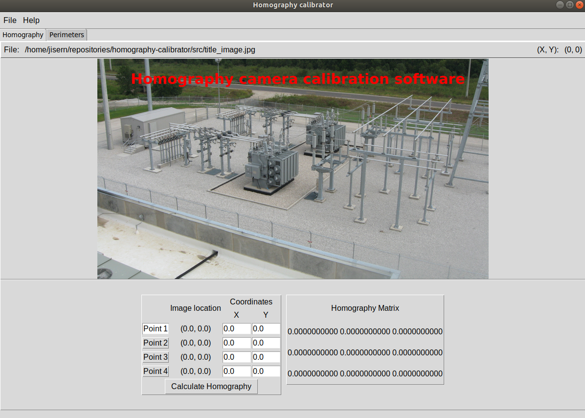

# Homography camera calibration software
The purpose of this project is to facilitate the calibration of one or more cameras by calculating the homographic matrix with respect to the dominant plane of the ground. 

  
 
 Once the homography has been calculated, the information can be stored in a configuration file. Similarly, information from a previous calibration can be retrieved.
 
 ## Future work
 * Calibrate camera(s) using a bird view perspective.
 * Calculate perimeters withing recorded scene.
 ## Authors
* **Juan Isern** - *Initial work* - [JuanIsernGhosn](https://github.com/JuanIsernGhosn/)