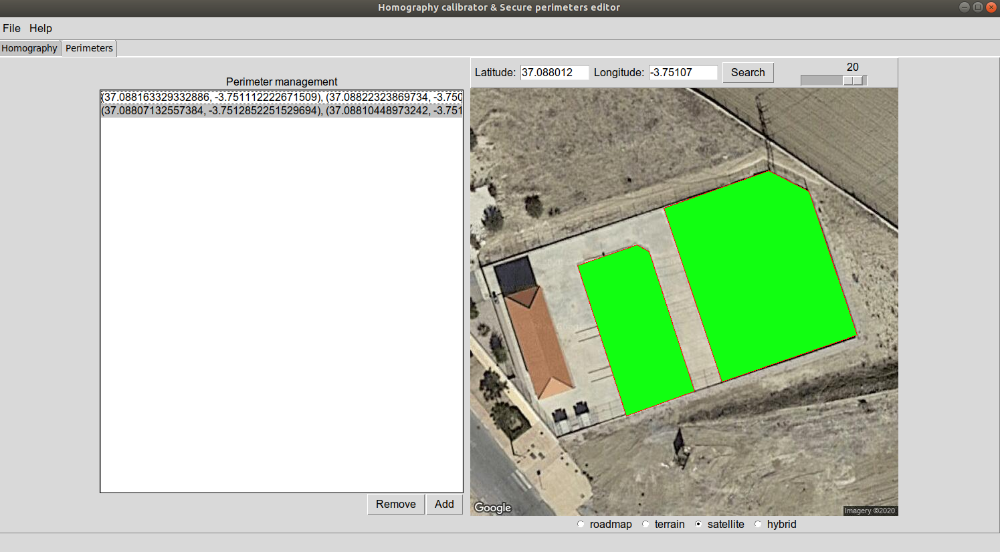

## Homography camera calibration tool & Secure perimeter editor
The purpose of this software is to assist in the calibration of one or more cameras by calculating the homographic matrix with respect to the dominant ground plane. Thus, a homographic correspondence is achieved between any position of an image from a camera and the position in real world coordinates.

Additionally, a module is included to create and edit perimeters on a bird's eye view of the world. In video surveillance tasks, it is often necessary to create perimeters to which special attention must be paid and which must be constantly monitored.

### Homography camera calibration tool

 
 
Briefly, the planar homography relates the transformation between two planes (up to a scale factor):
 

 
The homography matrix is a 3x3 matrix but with 8 DoF (degrees of freedom) as it is estimated up to a scale. It is generally normalized with h33=1 or h211+h212+h213+h221+h222+h223+h231+h232+h233=1.
 
Once the homography has been calculated, the information can be stored in a configuration file. Similarly, information from a previous calibration can be retrieved.
 
 ### Secure perimeter editor
 

 
This module allows the creation and editing of polygons from the point to point selection on a bird's eye view map, so that they can be used as perimeter information for surveillance tasks in sensitive areas. Thus, each perimeter will be given by a list of real world coordinate points in the format (latitude/longitude) 
 
 ### Demonstration video
 

 
 ## Future work
 * ~~Calibrate camera(s) using a bird view perspective.~~   *__DONE__*
 * ~~Calculate perimeters withing recorded scene.~~         *__DONE__*
 ## Authors
* **Juan Isern** - *Initial work* - [JuanIsernGhosn](https://github.com/JuanIsernGhosn/)

## License
*Homography camera calibration tool & Secure perimeter editor* is licensed under the [BSD 3-Clause license](https://github.com/JuanIsernGhosn/homography-calibrator/blob/master/BSD-3-CLAUSE-LICENSE.txt).
